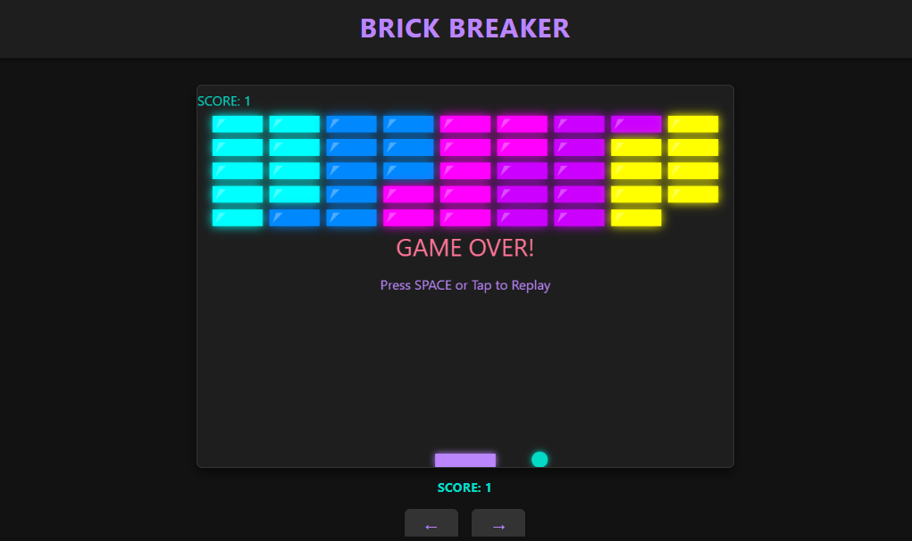

# 🎮 Brick Breaker | Neon Edition

A modern, neon-themed Brick Breaker game with responsive controls (keyboard + touch). Built with **Flask**, **HTML5 Canvas**, and **jQuery**.

## 🚀 Features
- **Glowing neon visuals** (purple paddle, teal ball, multi-colored bricks)
- **Score multiplier** for consecutive hits
- **Mobile-friendly** touch controls
- **Responsive design** (works on desktop/tablet/mobile)
- **Game over/restart** logic

## 🎮 Controls
- Keyboard: Left/Right arrow keys
- Touch: On-screen buttons (for mobile)

## 🔧 Technologies Used
- JavaScript
- HTML
- CSS
- Flask

## ✨ Gameplay
- Move the paddle using the left and right arrow keys.
- Hit the ball with the paddle to break the bricks.
- Try to break all the bricks without letting the ball fall below the paddle.
- Achieve the highest score possible!

## 🌐 **Web Application Interface**

